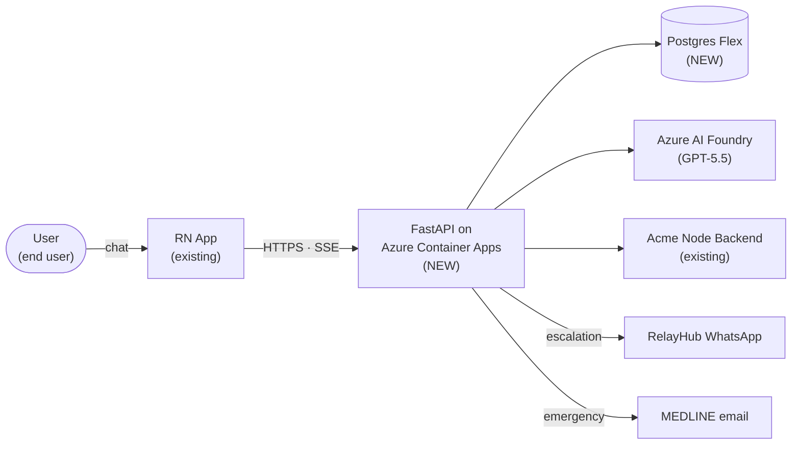
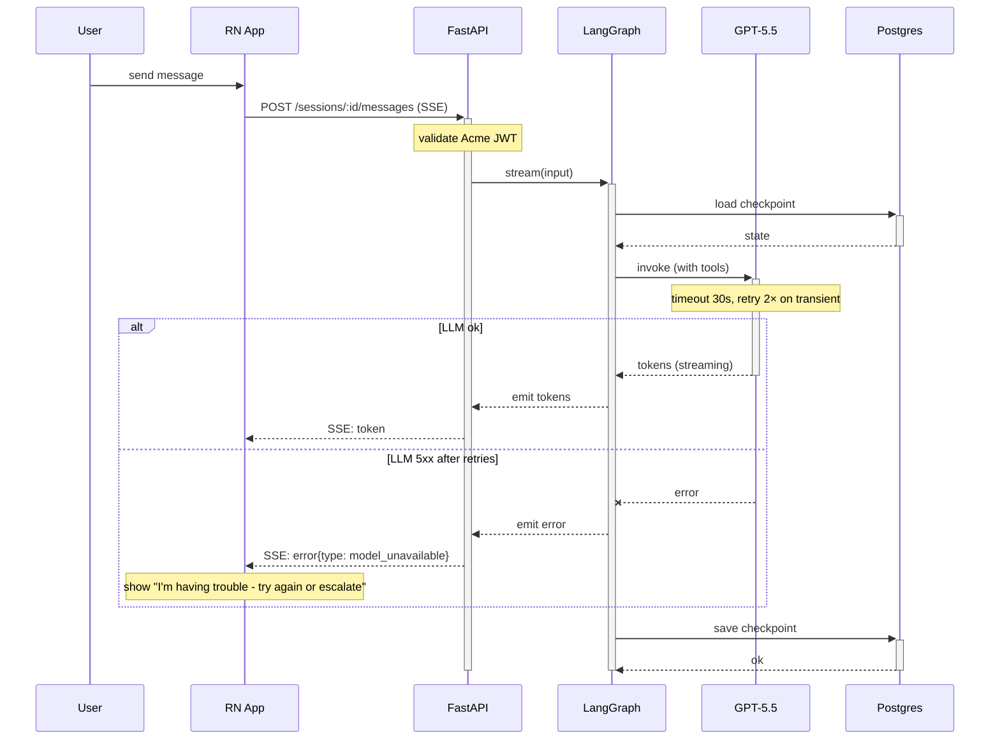

# Diagrams: C4 model + mermaid recipes

A picture beats a slab of text — but only when the picture earns its space. A boxes-and-arrows happy-path diagram is *worse* than no diagram, because it implies false completeness.

## House rules

1. **Required minimum (standard+ docs):** one C4 system context diagram + one sequence diagram for the critical flow.
2. **No happy-path-only diagrams.** Every architecture diagram shows retries, timeouts, failure paths, observability boundaries.
3. **Mermaid in the markdown source.** Survives copy-paste into Google Docs, Notion, GitHub. PlantUML is more powerful but lockier; mermaid wins on portability.
4. **Label every arrow.** What protocol? What payload? What auth? Unlabeled arrows are decoration.

## C4 model — only the top two levels matter

The C4 model has 4 levels (Context, Container, Component, Code). For design docs, you almost always only need the top two:

| Level | What it shows | When to include |
|---|---|---|
| **System Context** | Your system + external systems + users | Always |
| **Container** | Your services / data stores / interfaces | Unless trivial (1 service) |
| Component | Internals of a single container | Only when the proposal is reorganizing one container's internals |
| Code | Class/function level | Almost never — link to source instead |

### System context diagram (mermaid example)



### Container diagram (mermaid example)

```mermaid
flowchart TB
    subgraph rn["RN App"]
        chat[ChatScreen]
        hook[useAgentStream]
        sse[react-native-sse]
    end

    subgraph api["FastAPI"]
        auth[Auth middleware]
        sess[Session API]
        graph[LangGraph runtime]
        router[Router]
        agent_a[Returns agent]
        agent_b[Recommendations agent <br/>M2]
    end

    chat --> hook --> sse
    sse -->|POST /messages| auth --> sess --> graph --> router
    router --> agent_a
    router -.M2.-> agent_b
```

## Sequence diagrams — the highest-value diagram

A good sequence diagram is the second-most-read part of the doc (after the Summary). It surfaces failure paths and timing assumptions that prose hides.

### Required elements

- **Actors named** — who's calling whom (left→right ordering matches request flow).
- **Async boundaries explicit** — solid arrow for sync, dashed for async/SSE.
- **Failure paths shown** — `alt`/`opt`/`else` blocks for the obvious-but-easy-to-forget cases.
- **Retries and timeouts annotated** — "retry 3× w/ exponential backoff" is a 1-line annotation that prevents 3 incidents.
- **Observability boundary** — where do we emit a trace span / log / metric?

### Critical-flow sequence example (mermaid)



This single diagram pre-answers ~10 reviewer questions: What auth? Where's state? What's the retry policy? What does the user see when GPT is down? Is it streaming or polling? What persists?

## Anti-patterns

| Anti-pattern | Looks like | Why it hurts |
|---|---|---|
| **Happy-path-only** | Boxes connected with green arrows; no failures | Implies the system is failure-proof; reviewers skip the "what if X is down" question |
| **Boxes without behavior** | Just service names connected; no protocols, no labels | Reviewer can't critique what they can't see |
| **Code-level diagrams in design doc** | Class diagrams with private methods | Wrong altitude; link to source for code-level detail |
| **Diagram disagrees with prose** | "We use SSE"; diagram shows REST polling | Pick one; usually the diagram is right and the prose is stale |
| **No async distinction** | Solid arrows for everything | SSE/streams/queues are not the same as request/response; show it |
| **Too many actors** | 12 boxes, 30 arrows | Split into 2-3 simpler diagrams |
| **No deployment/infra context** | Pure logical view; no clue what runs where | For containerized/serverless docs, show what runs in which environment |

## When to skip diagrams

- **Mini ADR.** A single decision rarely needs a diagram. If it does, you might be writing the wrong format.
- **Pure refactor inside a single function/class.** Code review is the right place; link to a draft PR.
- **Trivial single-service additions.** A new endpoint on an existing service might need just a sequence diagram, not a context diagram.

## Tooling

| Tool | When |
|---|---|
| **mermaid** | Default. Renders in GitHub, Google Docs (with extension), Notion, Markdown previewers. Markdown source is portable. |
| **PlantUML** | Use only if mermaid genuinely can't express what you need (rare for context/container/sequence). |
| **draw.io / Excalidraw** | Use for one-off complex diagrams; export to PNG and inline. Mind that the source is harder to update. |
| **C4-PlantUML** | If you want strict C4 notation. Adds a learning step; usually mermaid + labels is enough. |
| **ASCII art** | Acceptable for trivial 3-box flows. Anything more, use mermaid. |

## Quick sanity check before shipping

After drawing each diagram, ask:
1. **Is every arrow labeled?** Protocol, payload type, sync/async.
2. **Is there at least one failure path shown?** Retries, timeouts, fallbacks, dead-letter queues.
3. **Does the diagram match the prose?** Do they agree on which services exist, which protocols are used, which auth scheme?
4. **Could a reviewer challenge a specific decision from this diagram?** If not, the diagram is decorative.

If all 4 pass, ship it.
