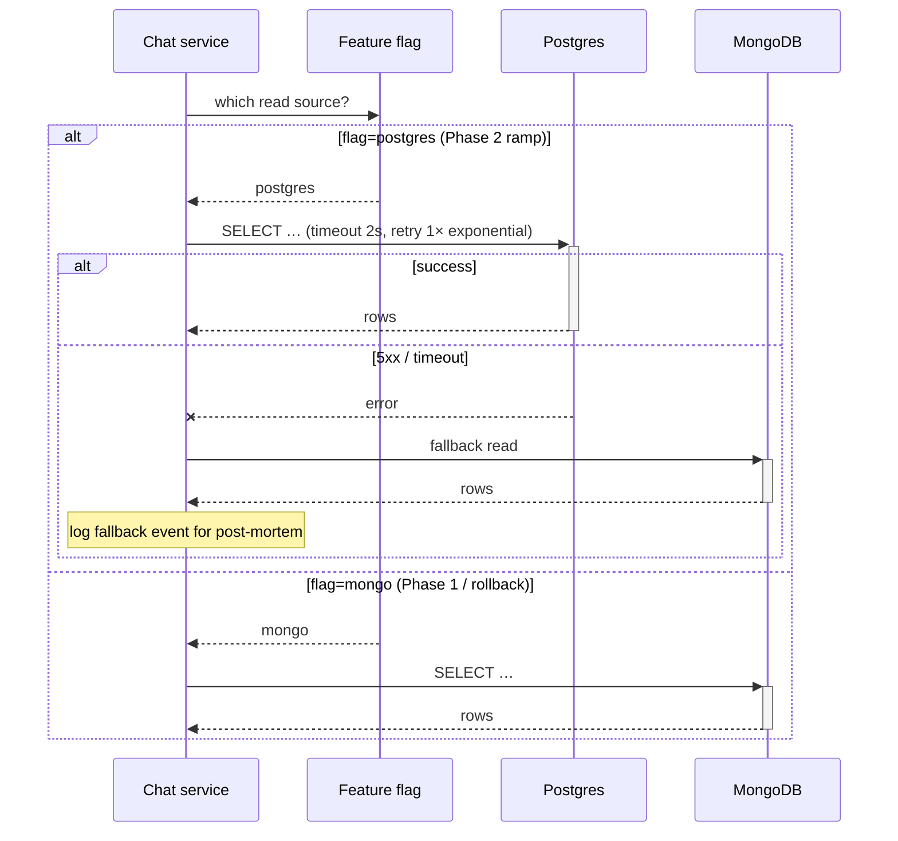

# Move chat-history store from MongoDB to Postgres

| Field | Value |
|---|---|
| Version | v0.2 |
| Author | Shahar Shavit |
| Created | 2026-04-28 |
| Last edited | 2026-05-03 |
| Status | In-Review |
| Approvers | Jordan (Acme), Northwind tech lead |
| Decision date | (pending — target 2026-05-15) |
| Pre-read window | 24h before review |

## 1. Summary

We propose migrating the chat-history store from the existing MongoDB cluster to Azure Database for PostgreSQL — Flexible Server, by 2026-07-01, to bring p95 chat-history query latency below 200ms (currently ~800ms) and consolidate operational ownership with our other Postgres-backed services. Decision needed by 2026-05-15 to keep the agent rollout on schedule.

## 2. Context

Today the chat-history store runs on a 3-node MongoDB cluster (replica set, no sharding). It serves ~1M reads/day across 3 services. Latency has degraded steadily over the last 6 months as message volume grew — p95 was 200ms in Oct 2025 and is 800ms today. Index tuning has bought some time; the next steps (sharding, more replicas) require operational expertise we don't have in-house.

We already operate Postgres for 4 other services, with established tooling (pgBouncer, Datadog dashboards, runbooks). Postgres on equivalent benchmarks shows p95 ~150ms for our workload shape (mostly point reads on session_id, occasional range queries on user_id + time).

This RFC is the technical follow-up to incident IR-2026-04 (chat-history latency degradation pageable on 2026-04-22).

## 3. Goals & Non-Goals

### Goals

- **G1.** p95 chat-history query latency ≤ 200ms (currently ~800ms). Measured via the existing OpenTelemetry trace dashboard; benchmark over a 7-day window post-cutover. Source: IR-2026-04 set the bar.
- **G2.** Reduce ops headcount allocation from 0.4 FTE (MongoDB cluster admin) to ≤ 0.1 FTE (within Postgres team's existing capacity). Measured via team time-tracking; benchmark over 3 months post-cutover.
- **G3.** Zero data loss during cutover. Measured via row-count parity check + checksum spot-check on 1% sample.
- **G4.** Read availability ≥ 99.9% during the migration window. Measured via existing SLO dashboard.

### Non-Goals

- **NG1. Schema redesign.** We will preserve the current message schema as-is (modulo Postgres-specific type changes). Schema redesign is a separate RFC after stabilization.
- **NG2. Client API changes.** Existing chat-history API contracts unchanged. Migration is server-side.
- **NG3. Multi-region replication.** Single-region for MVP. Multi-region is RFC-XXX-future.
- **NG4. Migrating other MongoDB collections.** Only the `chat_history` collection. Other collections stay on MongoDB.

## 4. Proposal

Dual-write phase, then cutover, then decommission. Total ~6 engineer-weeks across 3 phases.

### 4.1 Schema and indexes

The Mongo `chat_history` collection becomes a Postgres `chat_history` table:
- Primary key: `(session_id, message_id)` composite.
- Indexes: `(user_id, created_at DESC)` for the cross-session queries; `(session_id, created_at)` covers the common reads.
- JSONB column for the variable `metadata` field.

Trade-off: composite PK is slightly heavier on write than a serial PK, but the `(session_id, message_id)` query is the hot path for >95% of reads.

### 4.2 Dual-write window (Phase 1)

Both MongoDB and Postgres receive every write. Reads continue from MongoDB. Duration: 1 week. Goal: prove writes succeed on both sides, validate row count + checksums match on a 1% sample at the end.

### 4.3 Cutover (Phase 2)

Reads switch to Postgres at 10% → 50% → 100% over 3 days, behind a feature flag. Writes continue to both during this phase. Rollback = flag off (read flips back to MongoDB). Decommission MongoDB writes only after Phase 3 sign-off.

### 4.4 Decommission (Phase 3)

After 1 week of Postgres-only reads with no incidents, stop writing to MongoDB. Snapshot MongoDB and decommission the cluster. Snapshot kept for 30 days as a recovery option.

## 5. Diagrams

### System context

```mermaid
flowchart LR
    chat["Chat services<br/>(3 callers)"]
    mongo[("MongoDB<br/>(decommission)")]
    pg[("Postgres Flex<br/>(NEW)")]
    flag["Feature flag<br/>(read source)"]

    chat -->|write| mongo
    chat -->|write (Phase 1+2)| pg
    chat -->|read| flag
    flag -->|"Phase 1: 100%"| mongo
    flag -.->|"Phase 2: ramp 10/50/100%"| pg
```

### Cutover sequence



## 6. Alternatives Considered

| Axis | Status quo (MongoDB) | Shard MongoDB | **Migrate to Postgres** | Move to DynamoDB |
|---|---|---|---|---|
| Effort (engineer-weeks) | 0 | 4 | 6 | 8 |
| Hits goal G1 (p95 ≤ 200ms) | ❌ 800ms | ⚠️ 400ms est | ✅ 150ms (benchmarked) | ✅ 100ms est |
| Reduces ops burden (G2) | ❌ no | ❌ worse | ✅ yes | ⚠️ different burden |
| Zero data loss risk (G3) | ✅ baseline | ⚠️ resharding risk | ⚠️ migration risk, mitigated by dual-write | ⚠️ migration risk |
| Reversibility | n/a | hard | medium (Phase 1+2 reversible via flag) | hard |
| Operational familiarity | medium | low | high | low |

### A1. Status quo — keep MongoDB unchanged
**Why appealing:** Zero engineering cost, zero migration risk.
**Why we reject it:** Doesn't meet G1; latency keeps degrading with volume.

### A2. Shard MongoDB
**Why appealing:** Avoids the engine change; preserves operational continuity.
**Why we reject it:** Resharding is the most error-prone operation in MongoDB ops. Adds operational burden (G2 worse, not better). 4 weeks of effort for a 2× latency improvement that may not hold at next year's volume.

### A3. **Migrate to Postgres (proposal)**
**Why appealing:** Hits all goals. Reuses team's existing Postgres operational knowledge and tooling. Reversible during Phases 1-2 via feature flag.
**Trade-offs:** 6 weeks of engineer-time, requires careful dual-write phase, irreversible after Phase 3. Composite-PK schema slightly heavier on write than serial PK.

### A4. Move to DynamoDB
**Why appealing:** Strongest theoretical latency profile. Fully managed.
**Why we reject it:** New ops surface (no existing DynamoDB expertise). Locks us into AWS for this service while the rest of our infra is on Azure. Cost projections higher than Postgres at our shape.

## 7. Cross-cutting concerns

| Concern | Status | Notes |
|---|---|---|
| Security | ✅ | Same VPC, same auth. No new credential surface. |
| Privacy / PII | ✅ | Schema preserves existing PII handling; no new fields logged. |
| Observability | ✅ | Postgres Datadog integration already in place. New SLO dashboard for `chat_history` query latency before cutover. |
| Rollout / Rollback | ✅ | Feature flag per phase; flag-off reverts to MongoDB. Phase 3 (decommission) is the only irreversible step; gated on 1 week of clean Postgres-only reads. |
| Scalability | ✅ | Benchmarks at 3× current volume hold p95 ≤ 200ms. Reassess at 10× during the year. |
| Dependencies | ⚠️ | Adds `chat_history` to Postgres Flex's load. Confirmed with infra team that current node sizing handles +30% load. |
| Failure modes | ✅ | Top 3: (1) Postgres unreachable → fallback to MongoDB read; (2) dual-write divergence → row-count alert + checksum spot check; (3) flag flip backfires → rollback procedure documented. |
| On-call / runbook | ✅ | Existing Postgres runbook covers it; addendum for migration phases linked from this RFC. On-call team trained. |

## 8. Open questions

1. (for Northwind) Are there any callers of `chat_history` not on our service inventory?
2. (for Jordan) Is the Phase 2 ramp window (3 days) compatible with the planned mobile release?
3. (resolved during pre-read) ~~How do we handle in-flight reads at the moment of flag flip?~~ Answered: existing in-flight reads complete on whichever source they started on; only new reads see the new flag value.

## 9. Success metrics & SLAs

- **Primary:** p95 query latency ≤ 200ms over a 7-day post-cutover window. Dashboard: existing OTel trace.
- **Secondary:** read error rate ≤ 0.1%; write error rate ≤ 0.05%.
- **SLA breach:** if p95 exceeds 300ms for >1h, on-call investigates; >24h triggers a rollback discussion.

## 10. Next steps

- **2026-05-15:** RFC accepted (target).
- **2026-05-22:** Phase 1 (dual-write) kickoff. Owner: Shahar.
- **2026-05-29:** Phase 1 → Phase 2 gate (1% checksum check passes).
- **2026-06-05:** Phase 2 ramp 10/50/100%. Owner: Shahar.
- **2026-06-12:** Phase 2 → Phase 3 gate (1 week of clean Postgres-only reads).
- **2026-07-01:** Phase 3 decommission complete. Owner: Jordan.
- **Follow-up RFCs:** Multi-region replication (RFC-XXX-future); schema redesign (RFC-XXX-future).

---

## Decision log row

```
| 2026-05-15 | Move chat-history store from MongoDB to Postgres | Accepted | Shahar Shavit | drafts/design-mongo-to-postgres-migration-v2.md |
```

---

## Review protocol

- **Distribute:** ≥24h before review.
- **Comment window:** opens on distribution, closes at meeting start.
- **Meeting:** 60 min; 10 min silent re-read first.
- **Async escalation:** if ≥2 round trips on any thread, schedule sync.
- **After Accepted:** status updated, decision-log row appended, Phase 1 kickoff scheduled.
